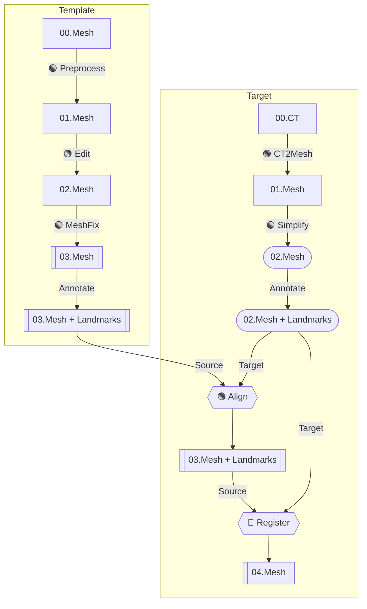

# 项目介绍

基于物理模拟的整形手术术后外形预测

## 问题

- **输入**: 术前 CT + 手术方案
- **输出**: 术后表面
- **数据**: 多组术前后 CT (未标注 landmarks)

## 贡献点

暂无

## 方法流程

🟢 DONE 🔵 Partially done, can move on 🟡 DOING 🔴 TODO

### 🔵 Registration

- **输入**: 术前, 术后 CT
- **输出**: 术前后同拓扑, 无穿模的 skull mesh & face mesh

#### 在 [^1] 基础上的改动

[^1]: Amberg, Brian, Sami Romdhani, and Thomas Vetter. 2007. “Optimal Step Nonrigid ICP Algorithms for Surface Registration.” In _2007 IEEE Conference on Computer Vision and Pattern Recognition_, 1–8. Minneapolis, MN, USA: IEEE. [https://doi.org/10.1109/CVPR.2007.383165](https://doi.org/10.1109/CVPR.2007.383165).

- 分区, 分步指定参数
- 参数搜索以避免穿模 (收效甚微)
- 寻找最近邻对应时考虑法向

### 🟡 Simulation

- **输入**: pre-surgery face mesh, pre-surgery skull mesh, post-surgery skull mesh
- **输出**: post-surgery face mesh

1. 🟢 使用 [TetGen](https://wias-berlin.de/software/index.jsp?id=TetGen) 在骨骼与表面之间填充四面体模拟软组织
2. 🟢 使用 [^2] 提出的 MTM (Mass-Tensor Model) 将问题转化为线性系统
3. 🟡 使用 [MINRES](https://docs.scipy.org/doc/scipy/reference/generated/scipy.sparse.linalg.minres.html) 求解

[^2]: Cotin, Stéphane, Hervé Delingette, and Nicholas Ayache. 2000. “A Hybrid Elastic Model Allowing Real-Time Cutting, Deformations and Force-Feedback for Surgery Training and Simulation.” _Visual Computer_ 16 (8): 437–52.

#### 线性系统

$$
\begin{bmatrix}
  K_{00} & K_{01} \\
  K_{10} & K_{11}
\end{bmatrix} \begin{bmatrix}
  \delta_0 \\
  \delta_1
\end{bmatrix} = \begin{bmatrix}
  f_0 \\
  f_1
\end{bmatrix}
$$

其中:

- 已知 $K$ --- 常稀疏矩阵, 不保证正定性与可逆性
- 已知 $\delta_0$ --- 紧邻骨骼的顶点位移
- 求解 $\delta_1$ --- 自由顶点的位移
- 未知 $f_0$ --- 紧邻骨骼的顶点所受外力, 即骨骼对软组织的力
- 已知 $f_1 = \mathbf{0}$ --- 自由顶点所受的外力, 平衡状态下为 0

可得:

$$
K_{11} \delta_1 = - K_{10} \delta_0
$$

### 🔴 评估

1. 🟡 计算逐顶点误差并可视化
